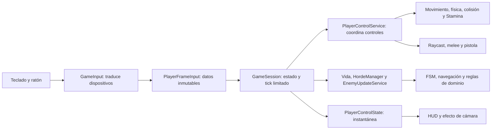

# Arquitectura de Minecraft2 — recuperación del Corte 2

## 1. Sistema y base del Corte 1

Minecraft2 es un juego voxel de un jugador, ejecutado en un proceso JVM. El Corte 1 incorporó mundos/chunks/bloques, generación finita, jugador, movimiento y colisión, interacción por raycast, vista LibGDX y persistencia JSON. Factory construye bloques; World publica BlockChange mediante Observer; WorldManager conserva el mundo activo mediante Singleton.

En el Corte 2 se incorporaron enemigos con FSM/A*, oleadas y estado de partida. La preparación de recuperación está en `4220c4051cf306cabfaaaa79ea8e4c90c868b631`. En esa base GameInput construía/coordinaba PlayerMovementService, PlayerPhysics, CollisionResolver y Stamina, y VoxelGame entregaba un callback a GameSession. Por tanto, la separación declarada en los diagramas no describía por completo la ruta de controles.

La versión de Thomas traslada esa coordinación a aplicación; conserva las reglas de dominio, velocidades, JSON v1 y prioridad de interacción. No agrega funcionalidad de negocio.

## 2. Reto y trazabilidad

El reto oral fue incorporar un enemigo. Esto exige mantener conducta y navegación independientes del render, coordinar su avance con el jugador y congelar ambos al pausar/morir. El coste de actualizar múltiples enemigos afecta el rendimiento; la frontera de entrada afecta mantenibilidad y testabilidad.

La [tabla obligatoria de seis columnas está en el README raíz](../../README.md#tabla-de-trazabilidad), que es su referencia única. Allí se enlazan decisiones, código, pruebas y resultados actuales con límites explícitos. El frente de controles ya tiene regresiones; caja negra de consola y nueva carga siguen pendientes. La presencia de biomas, menús o nuevas funciones no se presenta como una lista de retos asignados.

## 3. Estilo y alternativas

Se implementa una aplicación por capas con frontera de aplicación explícita. Esta selección corresponde a los criterios del reto analizados en la comparación siguiente; el ADR formal y la comparación ampliada corresponden al frente de Ethian y aún no están integrados.

| Criterio derivado del reto | Capas con coordinación explícita | Puertos y adaptadores completos |
| --- | --- | --- |
| Prueba de conducta y controles sin render | Datos de entrada y coordinador Java puro; reutiliza servicios existentes | Casos de uso y puertos para cada frontera; mayor independencia si se amplían adaptadores |
| Cambio de dispositivo/interfaz | Un traductor forma PlayerFrameInput sin modificar reglas | Adaptador de entrada implementa puertos explícitos |
| Almacenamiento real y pruebas | WorldStorage ya separa el contrato de JSON; su interfaz vive en persistence | El contrato se movería hacia el núcleo y la composición se reorganizaría |
| Proporción y coste en un escritorio de un jugador | Cambio acotado: tres clases, conexión visual y pruebas; conserva estructura existente | Más interfaces, movimiento de paquetes y revisión de consumidores; no hay reto de múltiples proveedores/remotos confirmado |
| Rendimiento de IA | El cambio de frontera no reduce por sí solo búsquedas o expansiones A* | El aislamiento tampoco mejora por sí solo A*; ambos requieren medir y optimizar el cuello real |

La frontera de aplicación permite probar controles sin Gdx y limita el punto que coordina una partida. Se sacrifica simplicidad de cableado: nuevos contratos, un objeto de entrada por tick y adaptación de HUD/tests. No se declara arquitectura hexagonal completa: WorldStorage sigue en persistence, hay colaboración domain.world ↔ domain.player y permanecen apoyos en Factory/Observer/Singleton.

**Pendiente de integración:** ADR con contexto, opciones, decisión, consecuencias positivas y negativas, y confirmación de su concordancia con el código final. El texto anterior no se presenta como un ADR ya publicado.

## 4. Arquitectura inicial y evolucionada

Las [vistas UML previas](uml.md) se conservan como históricas, sin rotularlas como recuperación. La comparación visual del Corte 1 con la versión combinada y las vistas completas C4 de contexto/contenedor/componentes aún corresponden al frente de Ethian.

Flujo actual de los controles, comprobado en la rama Thomas:



Reglas de dependencia:

- domain no importa application, presentation, persistence ni LibGDX. Su apoyo en patterns se conserva y se declara.
- application coordina casos de uso sin LibGDX ni presentation. WorldApplicationService usa la abstracción WorldStorage, no un render ni un menú.
- GameInput solo lee Input y produce PlayerFrameInput; no tiene mundo, física, colisiones ni estamina mutable.
- VoxelGame controla recursos y ciclo gráfico, entrega la entrada a GameSession y consulta el modelo para renderizar. Cámara, mallas, HUD y fullscreen permanecen en presentación.
- JsonWorldStorage concentra archivos; el códec concentra JSON. Bootstrap compone el arranque; GameSession compone sus servicios de sesión.
- La lectura visual del dominio no autoriza coordinación física desde presentación. El Observer inverso notifica mediante un contrato sin depender de la vista concreta.

Contrato disponible:

```java
GameSession session = new GameSession(world, settings);
session.advance(deltaSeconds, PlayerFrameInput.NEUTRAL);
PlayerControlState state = session.controls();
```

PlayerFrameInput contiene MovementInput, salto, mirada, acción primaria/secundaria, alternancia de arma y material opcional. `selectedType == null` conserva el material; AIR se rechaza. La neutral mantiene ausencia de acciones pero permite gravedad/vida/IA durante RUNNING.

GameSession descarta deltas no finitos, negativos o cero antes de usar la entrada; pausa y muerte descartan el tick. Un delta positivo se limita a 0,05 s para todos los componentes. PlayerControlService, como operación directa, rechaza deltas negativos/no finitos mediante excepción; esta diferencia conserva el contrato anterior. No existe el avance por Runnable.

Orden de control: mirar → mover/saltar/colisionar → alternar pistola → seleccionar material y desequipar → acción primaria/secundaria. Pistola equipada nunca pica un bloque al fallar o estar en cooldown; sin pistola, melee tiene prioridad y se pica únicamente si no hay enemigo alcanzable. El sprint consume según desplazamiento horizontal real; teclas opuestas y paredes no consumen. Respawn restaura estamina/flags y conserva el material; no levanta una pausa existente.

## 5. Estrategia de pruebas

Unitarias: reglas de dominio y adaptadores aislados sin disco/red/ventana. Incluyen equivalencias, límites y casos inválidos; los tests nuevos usan datos y un doble Input para aislar dispositivos. No se convierte toda la suite en “unitaria” por usar JUnit.

Integración: coordinadores de sesión/control/IA con componentes reales y mundo determinista en memoria; almacenamiento JSON en directorios temporales; menú/Observer con modelos reales. La infraestructura apropiada para este juego es el archivo JSON local, sin añadir HTTP/BD a un sistema que no los usa. El flujo público en proceso separado sigue pendiente de Jasub.

Gráfica: PlayerControlsVisualSmoke abre OpenGL real, automatiza la entrada y verifica controles y estado mientras VoxelGame renderiza cámara/HUD. No es un flujo público de consola ni una evaluación humana.

Carga: el harness histórico mide IA headless. Ethian aporta scripts, SLO previo, baseline/estrés, throughput, p95, errores y análisis. No se atribuye una mejora de velocidad al traslado de capas sin medición comparable.

Comandos por nivel y reportes: [README](../../README.md#ejecutar-pruebas-por-nivel) y [pruebas](pruebas.md).

## 6. Resultados y evidencia

La [verificación de Thomas](pruebas.md) ejecutó 191 pruebas Surefire y 144 Failsafe, sin fallos, errores ni omitidas. Las 60 clases de la base siguen ejecutándose tras mapear la migración de GameInputStaminaTest a PlayerControlStaminaTest; ningún runner comparte una clase con el otro.

JaCoCo reporta solo domain: unitarias 885/982 líneas (90,12 %) y 555/693 ramas (80,09 %); integración 900/982 líneas (91,65 %) y 540/693 ramas (77,92 %). Son reportes independientes; no se suman ni incluyen automáticamente procesos de JAR separados.

El smoke OpenGL automatizado pasó en Intel/Mesa Linux. Los CSV, casos, captura y huellas de fuentes están en [evidencias/thomas](recuperacion-c2/evidencias/thomas/manifest.json). Pruebas y build se repitieron en una copia sin target previo. Los resultados históricos de septiembre no se sustituyen por estos ni se presentan como mediciones nuevas de carga.

PIT conserva su selección original y se comprobó nuevamente; [resultado de mutación](pruebas.md#mutación). La nueva carga y el flujo de caja negra aún no tienen resultado en esta rama.

## 7. Límites y tercer corte

- Mundo finito completo en memoria, un jugador y estado global de WorldManager; no hay streaming ni arquitectura distribuida.
- Coordinación concentrada en GameSession/PlayerControlService; la separación hace comprobables las responsabilidades pero no elimina todos los acoplamientos de dominio.
- JSON v1 conserva el mundo/jugador; vida, arma, enemigos, oleadas, restos y estamina son estado de sesión.
- La carga headless de IA no garantiza FPS gráficos; la prueba visual automatizada tampoco acredita jugabilidad prolongada, equilibrio o SUS.
- Antes de entregar la recuperación se deben integrar ADR/vistas completas/carga de Ethian y pruebas de flujo público/fronteras de Jasub, y repetir la verificación del candidato conjunto.
- El tercer corte requiere su consigna vigente antes de definir pipeline/DevSecOps o gates. No se agregan requisitos hipotéticos ni se presupone un umbral de cobertura del 80 %.
