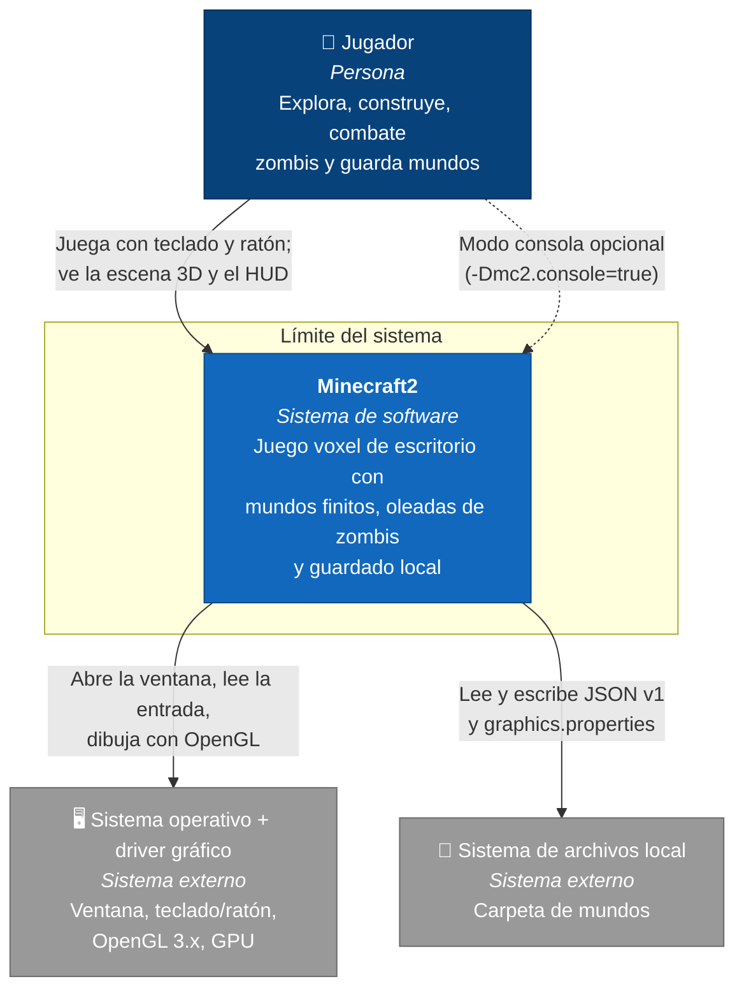

# C4 nivel 1 — Contexto

Versión: `4220c40`. Es la vista actual y la recuperación no la cambia.

## Notas

- Hay un solo actor humano. No hay multijugador, red ni servicios remotos: todo ocurre en la máquina del jugador.
- El **reto oral**, incorporar un enemigo, vive por completo dentro del sistema. Los zombis no son un sistema externo: son modelo del dominio (`domain.enemy`) que coordina la aplicación (`EnemyUpdateService` y `HordeManager`).
- La carpeta de mundos se resuelve con `bootstrap.WorldDirectory`, por defecto junto al proyecto o al JAR, y se puede cambiar con `-Dmc2.worlds.dir`. La preferencia de GPU se guarda en `graphics.properties`, junto a esa carpeta y fuera del JSON.
