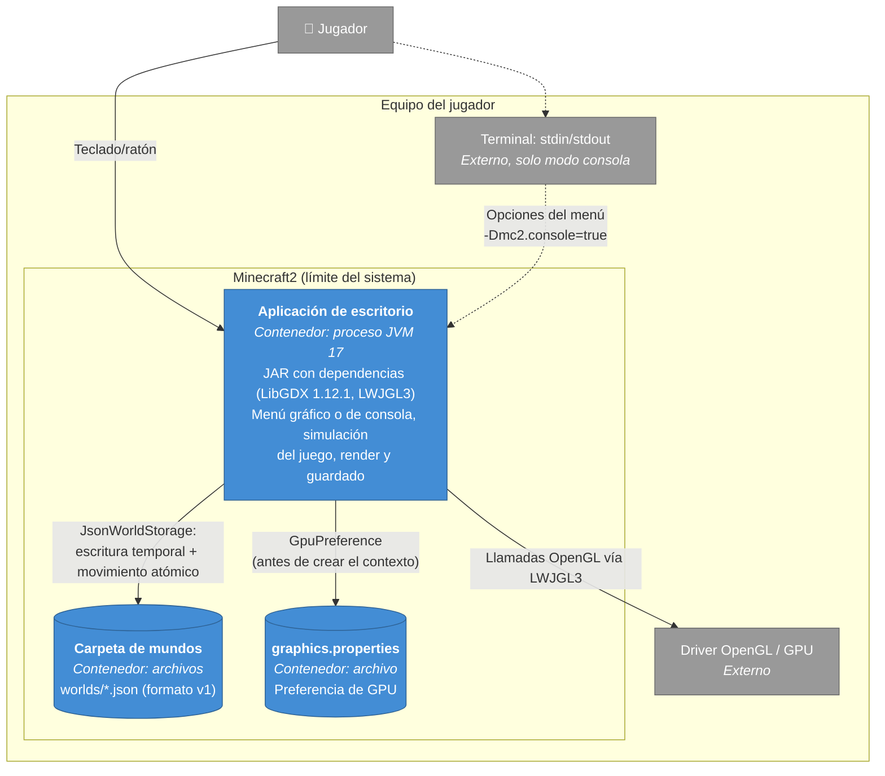

# C4 nivel 2 — Contenedores

Versión: `4220c40`. Es la vista actual y la recuperación no la cambia.

Un contenedor en C4 es algo que se ejecuta o que guarda datos. Minecraft2 tiene **un solo proceso**: no hay Docker, servidor ni base de datos.

## Notas

- La IA de enemigos, las oleadas y la física se ejecutan **en el hilo de render** de LibGDX, dentro de `VoxelGame.render`, una vez por fotograma. Por eso su coste por tick compite con el dibujo. Ver [carga.md](../../recuperacion-c2/carga.md).
- El modo consola (`-Dmc2.console=true`) usa la misma aplicación y el mismo `WorldApplicationService`. Es la interfaz pública que ejercita la prueba de caja negra de Jasub (REC-J4).
- `-Dmc2.gpu=AUTO|INTEGRATED|DEDICATED` y la preferencia guardada se aplican antes de crear el contexto OpenGL. No hay cambio de GPU en caliente.
