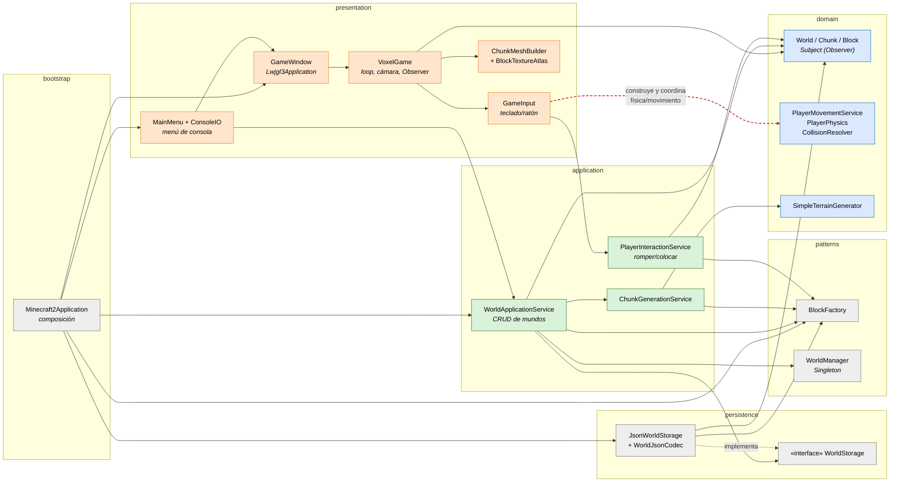

# C4 nivel 3 — Componentes del Corte 1 (histórica)

> **Vista histórica.** Corresponde al commit `5501b02` (24-08-2026), el último del Corte 1. No describe el código actual.

Contenedor: aplicación de escritorio en la JVM. El menú era **solo de consola**. Elegir «jugar» abría la ventana LibGDX.

## Reglas de dependencia observadas en `5501b02`

| Regla | Estado en el Corte 1 |
| --- | --- |
| `domain` sin LibGDX ni capas superiores | Se cumple. El único acoplamiento es `domain.world` → `patterns.observer`. |
| `application` sin LibGDX | Se cumple. Depende de `persistence.WorldStorage`, que es una interfaz. |
| Presentación sin coordinación de reglas | **No se cumple.** `GameInput` crea `PlayerMovementService`, `PlayerPhysics` y `CollisionResolver` y avanza la física cada fotograma (flecha roja). |

Todavía no existían enemigos, sesión de juego, estamina ni menú gráfico. Esta es la base sobre la que el Corte 2 añadió el reto del enemigo.
