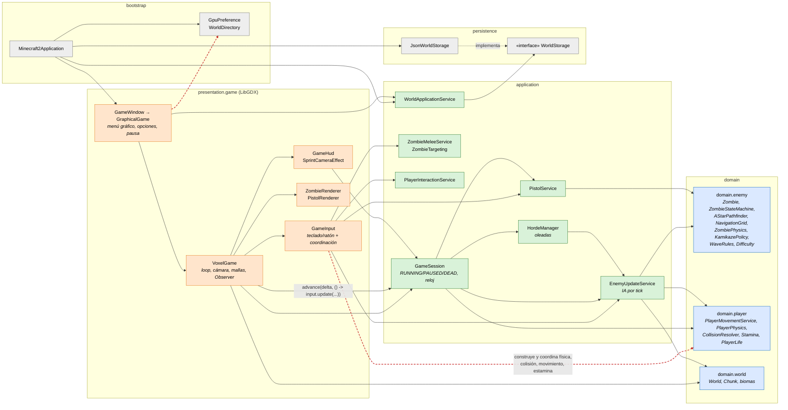
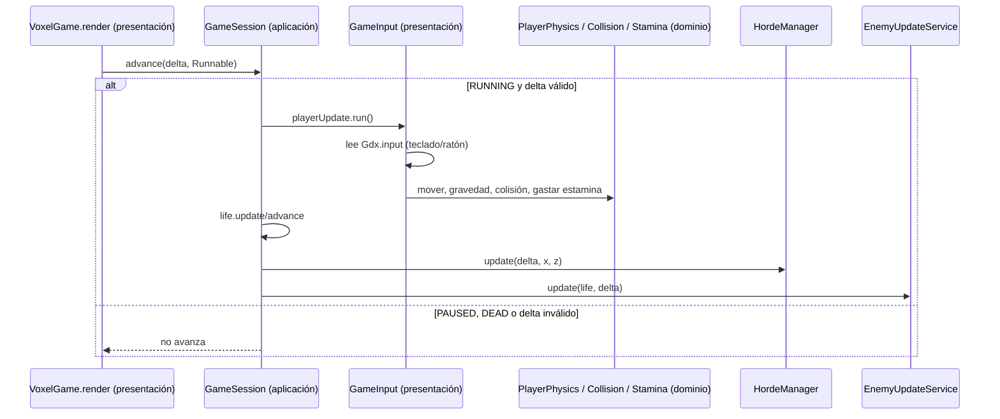

# C4 nivel 3 — Componentes al cierre del Corte 2 (histórica, antes de la recuperación)

> **Vista histórica.** Corresponde al commit `4d33d6a`, cierre del Corte 2. `4220c40` solo añade documentación y tiene el mismo código fuente. Es el estado de partida de la recuperación, no el resultado.

Contenedor: aplicación de escritorio en la JVM. Solo se muestran los componentes del juego y del reto. Menús, skins, diagnóstico de GPU y renderers auxiliares se agrupan.

## Secuencia de un tick (antes)

## Reglas de dependencia observadas en `4d33d6a`

| Regla (ADR-001 §5) | Estado |
| --- | --- |
| 1. `domain` sin capas superiores ni LibGDX | Se cumple. Persiste el ciclo `domain.world` ↔ `domain.player`. |
| 2. `application` sin presentación ni LibGDX; solo `persistence.WorldStorage` | Se cumple. |
| 3. `GameInput` sin coordinadores de física, movimiento ni estamina | **No se cumple** (REC-04). |
| 4. Una sola entrada de avance con datos | **Parcial.** `GameSession` es el único reloj, pero recibe un `Runnable` de la vista. |
| 5. La vista solo lee el modelo | **No se cumple** para el jugador. `GameInput` también llama a `EnemyUpdateService`, `PistolService` y `ZombieMeleeService` para el combate. |

Límite adicional: `presentation.game.GraphicalGame` → `bootstrap.GpuPreference`, una dependencia hacia la raíz de composición (línea discontinua).

Lo que sí resolvió el Corte 2 para el reto: FSM, A\*, física del zombi y reglas de oleada están en `domain.enemy`, sin LibGDX. `GameSession` es el único reloj de vida, hordas, enemigos y pistola.
