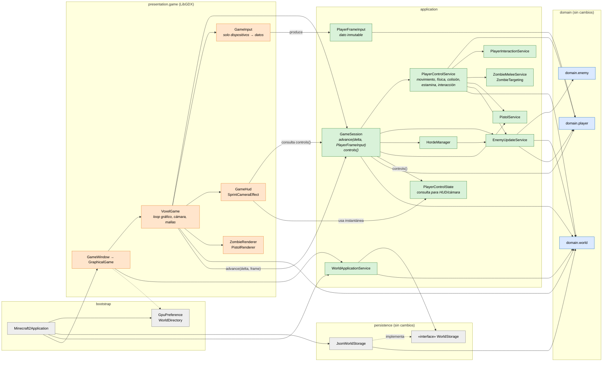
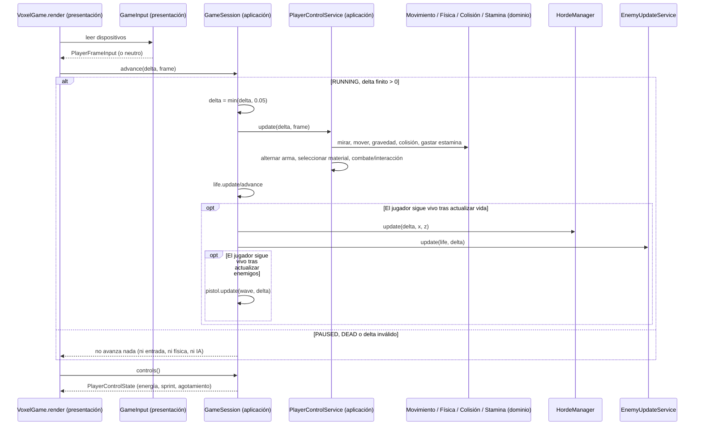

# C4 nivel 3 — Componentes de la recuperación

> **Vista implementada.** Contrasta el contrato con las clases de `e730e9c` y la integración de `jasub/final-a` y `feature/c2-Ethian`. Los hashes exactos del candidato comprobado están en el [manifiesto integrado](../../recuperacion-c2/evidencias/integracion/manifest.json).

Respecto al [cierre del Corte 2](04-componentes-corte2-cierre.md) cambia lo siguiente: `GameInput` solo traduce dispositivos, la coordinación del jugador pasa a aplicación y `GameSession` recibe datos en lugar de un callback.

El combate lo coordina PlayerControlService: mirada → movimiento/física/colisión/estamina → arma → material → acción primaria/secundaria. GameSession conserva después la secuencia vida → hordas → enemigos → pistola mientras el jugador sigue vivo. HUD y cámara reciben PlayerControlState mediante controls().

## Secuencia de un tick (implementada)

## Reglas de dependencia comprobadas

Las reglas 1 a 3 y la firma de avance del ADR-001 §5 se comprueban en `test/architecture/ArchitectureBoundaryTest.java`. GameSessionTest y el smoke OpenGL comprueban el avance y la conexión visual. La revisión de las llamadas completa la comprobación de la ruta normal. Siguen como límites declarados `GraphicalGame` → `bootstrap.GpuPreference`, `application` → `persistence.WorldStorage` y el ciclo `domain.world` ↔ `domain.player`.
