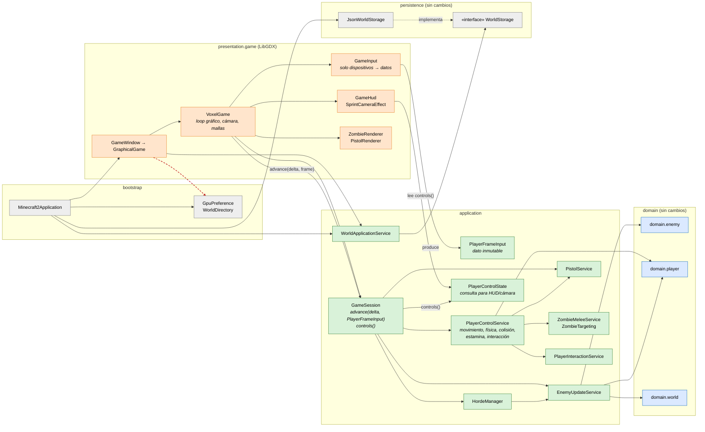
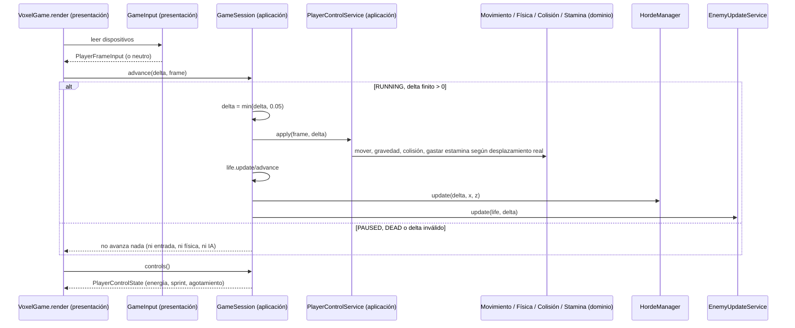

# C4 nivel 3 — Componentes de la recuperación (BORRADOR)

> **Borrador según el contrato**, todavía sin verificar contra el código. Se basa en la API propuesta en `plan-equipo.md` §3 y en [ADR-001](../../adr/ADR-001-estilo-recuperacion.md) §5. Cuando se integre `feature/c2-Thomas` (REC-T1/T2), Ethian actualizará este diagrama con los `import` reales y anotará aquí el commit. Hasta entonces **no describe código existente**.

Respecto al [cierre del Corte 2](04-componentes-corte2-cierre.md) cambia lo siguiente: `GameInput` solo traduce dispositivos, la coordinación del jugador pasa a aplicación y `GameSession` recibe datos en lugar de un callback.

**Pendiente de confirmar al integrar.** No sabemos todavía si el combate (pistola y puños) lo coordina `PlayerControlService` o se queda en otra ruta de aplicación. El plan habla de «acción primaria/secundaria» y «alternancia de pistola» en `PlayerFrameInput`. Las flechas `control → melee/pistol` reflejan esa intención y se corregirán según el código real.

## Secuencia de un tick (después, según el contrato)

## Reglas de dependencia objetivo

Son las reglas 1 a 5 de ADR-001 §5. Las verifica automáticamente `test/architecture/ArchitectureBoundaryTest.java` (REC-J6, de Jasub). Siguen como límites declarados, en rojo, `GraphicalGame` → `bootstrap.GpuPreference`, `application` → `persistence.WorldStorage` y el ciclo `domain.world` ↔ `domain.player`.
