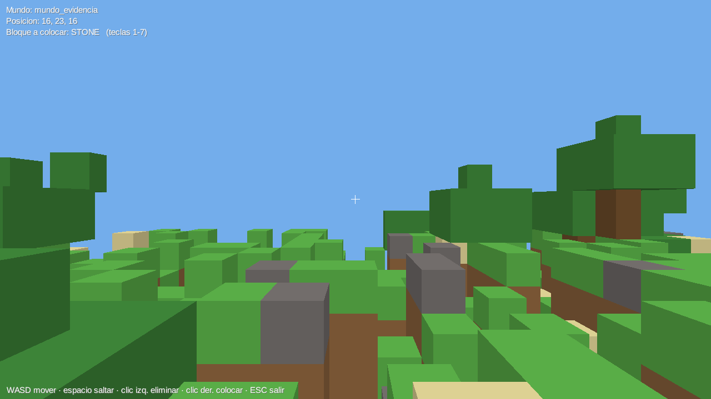

# CT-10 — Renderizado: la ventana abre y muestra la superficie de un chunk

**Criterio de terminado:** la aplicación abre una ventana y muestra la superficie de un chunk sin
excepción.

## Evidencia



Captura real del juego, tomada por la propia aplicación (ver más abajo). Se distinguen el césped,
la tierra bajo los bordes, la arena, la grava y los árboles con tronco de madera y copa de hojas.

## Cómo reproducirlo

```bash
mvn clean package
java -Dfile.encoding=UTF-8 -jar target/minecraft2-0.1.0-SNAPSHOT.jar
```

Luego: `1` para crear un mundo, y `6` para jugar.

### Controles

| Acción | Control |
| --- | --- |
| Moverse | W, A, S, D |
| Saltar | Espacio |
| Mirar | Ratón |
| Eliminar bloque | Clic izquierdo |
| Colocar bloque | Clic derecho |
| Elegir material | Teclas 1 a 7 |
| Volver al menú | ESC o cerrar la ventana |

## Captura automática

La aplicación sabe fotografiarse a sí misma, que es lo que genera la imagen de arriba:

```bash
java -Dmc2.screenshot=C:/ruta/captura.png -Dmc2.screenshot.frame=30 \
     -jar target/minecraft2-0.1.0-SNAPSHOT.jar
```

Dibuja el número de fotogramas indicado, guarda el PNG y se cierra. Existe porque CT-10 pide
literalmente una captura de pantalla como prueba, y porque permite comprobar el resultado visual
sin depender de que alguien mire la ventana en el momento justo.

Detalle a tener en cuenta si se toca ese código: OpenGL entrega el framebuffer con el origen abajo
a la izquierda, así que la imagen hay que invertirla fila por fila antes de guardarla. Sin eso el
PNG sale boca abajo.

## Rendimiento del descarte de caras

Dibujar los seis lados de cada cubo sería inviable. Solo se emiten las caras que dan a aire, y la
propia aplicación informa de la cifra al arrancar:

```
[render] 4 chunks, 21913 bloques, 8544 caras dibujadas de 131478 posibles (6,5%), en 176 ms
```

**Se descarta más del 93 % de la geometría.** Si esa proporción subiera mucho, sería señal de que
el descarte dejó de funcionar y habría que revisarlo antes que el rendimiento.

## Punto de aparición

El jugador aparece sobre el punto de terreno más alto cercano al centro del mundo generado, en vez
de en una posición fija. Las dos primeras versiones lo dejaban caer desde el cielo a una columna
fija: aterrizaba a menudo en una hondonada rodeada de terreno más alto y la cámara quedaba pegada a
una pared, dando la impresión de que el renderizado estaba roto cuando funcionaba bien. Se descartan
las cimas de madera y hojas para no aparecer dentro de un árbol.

## Qué se comprobó y cómo

| Comprobación | Resultado |
| --- | --- |
| La ventana abre sin excepción | OpenGL 4.6 sobre AMD Radeon Vega 8 |
| El terreno se ve, con relieve legible | Captura de arriba |
| Los ocho tipos de bloque se distinguen | Césped, tierra, piedra, arena, grava, madera y hojas visibles; el aire no se dibuja |
| Gravedad y colisión | El jugador cae desde el cielo y se detiene sobre el terreno, comprobado leyendo su altura tras aterrizar |
| Abrir la ventana dos veces en la misma sesión | Se entra, se sale al menú y se vuelve a entrar sin fallo |
| La vista reacciona a colocar y eliminar bloques | `presentation.game.VoxelGameObserverTest` comprueba el cableado del Observer sin necesitar gráficos |

## Lo que queda por confirmar a mano

El movimiento con teclado y ratón, y que la malla se redibuje al colocar o eliminar un bloque, solo
pueden comprobarse jugando: no se pueden simular pulsaciones reales desde un guion. El cableado
está cubierto por la prueba automática, pero **la sensación de juego y el redibujado hay que verlos**.

Guion sugerido: crear un mundo, entrar con `6`, caminar y saltar, apuntar a un bloque y eliminarlo
con clic izquierdo comprobando que desaparece de inmediato, colocar otro con clic derecho, cambiar
de material con las teclas 1 a 7, salir con ESC, guardar con `4`, y volver a entrar para confirmar
que los cambios siguen ahí.

## Entorno

Windows 11, JDK 17.0.10, Apache Maven 3.9.9, LibGDX 1.12.1 con backend LWJGL3.
