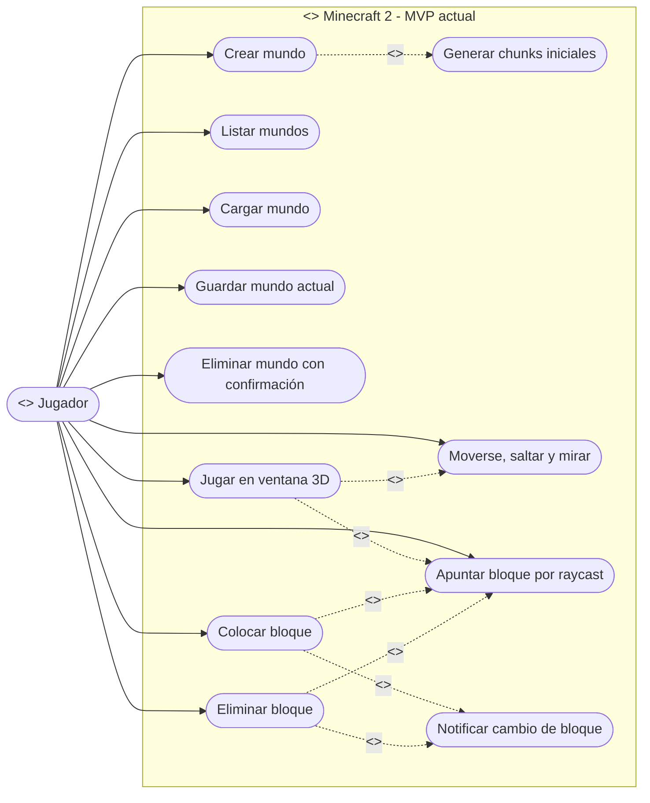
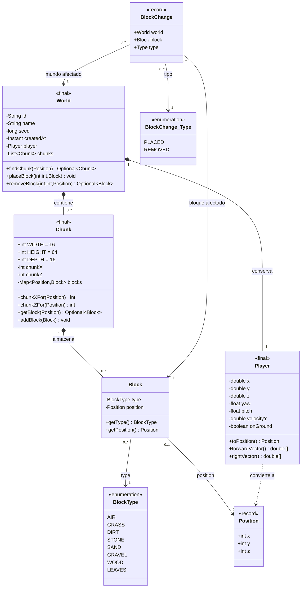
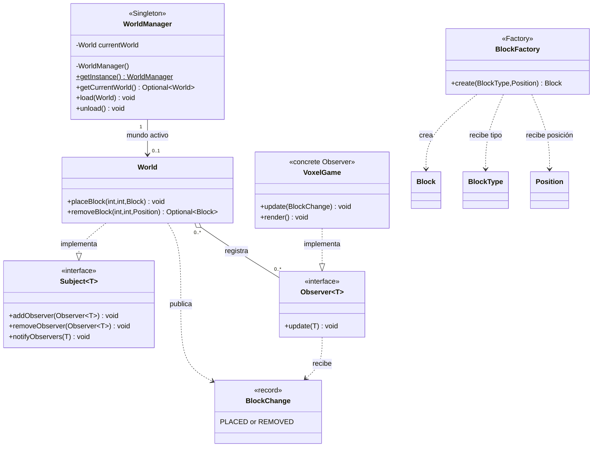
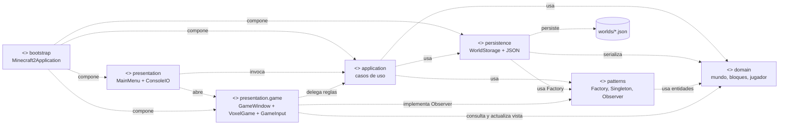
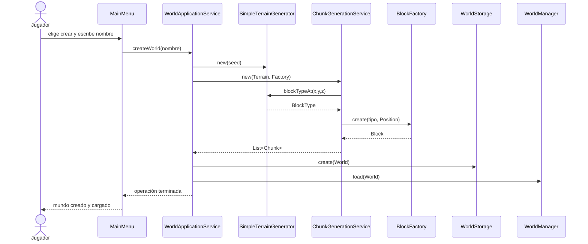
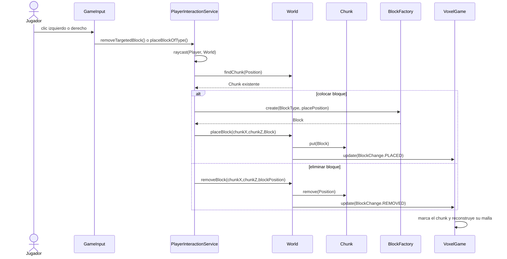

# Diagramas UML de Minecraft 2

> Diagramas contrastados con el código integrado el 23 de agosto de 2026. Describen solamente comportamiento y clases existentes, incluido el renderizado voxel, la ventana 3D y los controles básicos de teclado y ratón incorporados en `presentation.game`.

## Guía rápida

La rúbrica exige un **diagrama de clases UML** consistente con el código. Este documento incluye ese diagrama principal y cuatro vistas complementarias: casos de uso, patrones, componentes y secuencias. Cada una responde una pregunta distinta sin inventar clases ni patrones que el proyecto no tiene.

| Vista | Pregunta que responde | Evidencia principal |
| --- | --- | --- |
| Casos de uso | ¿Qué operaciones ofrece el MVP? | `MainMenu`, `GameWindow`, `GameInput` |
| Clases del dominio | ¿Cuáles son los objetos y relaciones del juego? | `domain/` |
| Patrones | ¿Dónde están Factory, Singleton y Observer? | `patterns/`, `World` |
| Componentes | ¿Cómo se separan las responsabilidades? | paquetes del proyecto |
| Secuencias | ¿Cómo colaboran objetos en una operación crítica? | creación de mundo e interacción |

## 1. Casos de uso del MVP

El actor inicia desde el menú de consola y puede entrar a una ventana 3D. `GameInput` traduce teclado y ratón a los servicios de movimiento, física, colisión e interacción con bloques.

**Interpretación:** las primeras cinco operaciones son opciones explícitas de `MainMenu`; `Jugar` abre `GameWindow`. La generación ocurre al crear un mundo. Movimiento, salto, mirada y clics se procesan por fotograma desde `GameInput`; colocar y eliminar delegan a `World`, que es quien produce el cambio observable.

## 2. Diagrama de clases del dominio

Este es el diagrama de clases obligatorio. La composición indica que los `Chunk` pertenecen al `World` y los `Block` son almacenados por su `Chunk`. Las multiplicidades aparecen en ambos extremos de todas las asociaciones estructurales: el número cercano a una clase indica cuántas instancias de esa clase pueden relacionarse con una instancia del extremo opuesto.

`Position` es inmutable y usa enteros. `Player` trabaja con coordenadas continuas para permitir movimiento y física, y usa `toPosition()` al consultar el mundo; por eso esa flecha es una dependencia punteada, no una asociación con multiplicidad. `BlockChange_Type` representa el enum anidado real `BlockChange.Type`. `Chunk` concentra la validación de sus dimensiones `16 x 64 x 16` y de pertenencia de posiciones.

### Leyenda de notación UML

| Notación | Significado en este modelo |
| --- | --- |
| `<<actor>>`, `<<system>>` | Estereotipos: etiquetas UML entre dobles signos menor/mayor; no son comparaciones. Identifican al actor externo y al límite del sistema en la vista de casos de uso. |
| `<<record>>`, `<<enumeration>>`, `<<interface>>` | Estereotipos de un record inmutable, un enum de valores fijos y un contrato que otras clases implementan. |
| `+` / `-` / `$` | Miembro público / privado / estático. Por ejemplo, `+getInstance() WorldManager$` es el acceso estático al Singleton. |
| `1` | Exactamente una instancia en ese extremo de la relación. |
| `0..1` | Cero o una instancia: relación opcional. `WorldManager` puede no tener un mundo cargado. |
| `0..*` | Cero o muchas instancias. Un mundo puede contener ningún chunk al inicio o muchos chunks después. |
| `*--` | Composición, representada por rombo lleno junto al dueño. Si el dueño deja de existir, sus partes no tienen sentido dentro de ese agregado. |
| `o--` | Agregación, representada por rombo vacío. `World` registra observadores, pero no controla su ciclo de vida. |
| `-->` | Asociación navegable: una clase conserva o conoce estructuralmente a la otra. |
| `..>` | Dependencia punteada: una clase usa, crea o convierte a otra sin almacenarla como parte de su estado. |
| `..>` | Realización: una clase implementa una interfaz. `World` implementa `Subject<BlockChange>`. |

Las multiplicidades se leen desde el extremo opuesto. Por ejemplo, `World "1" *-- "0..*" Chunk` expresa que cada `World` contiene de cero a muchos `Chunk` y que cada `Chunk` pertenece a exactamente un `World`.

## 3. Diagrama de patrones de diseño

Solo aparecen los tres patrones autorizados por el alcance: Factory, Singleton y Observer.

**Justificación técnica:** `BlockFactory` centraliza la creación de los bloques. `WorldManager` es la única instancia global y solo conserva el mundo activo. `World` notifica cambios sin conocer una tecnología gráfica concreta; `VoxelGame` es el observador visual real y reconstruye la malla del chunk afectado.

## 4. Diagrama de componentes y dependencias

Las líneas punteadas representan dependencias entre componentes. El dominio no depende de presentación ni de archivos.

`bootstrap` solo compone objetos al iniciar. `presentation` conversa con `application` y abre `presentation.game` para jugar. `GameInput` delega las reglas en los servicios existentes y `VoxelGame` consulta el dominio para dibujarlo; el dominio sigue sin depender de la interfaz. `JsonWorldStorage` implementa el contrato `WorldStorage` y concentra el acceso a JSON. Las multiplicidades no se usan en esta vista porque los componentes son paquetes y contratos, no objetos que el código almacene en colecciones.

## 5. Secuencia: crear un mundo

El generador decide el tipo de bloque, Factory construye el objeto y el servicio de aplicación coordina el caso de uso. `World` no asume responsabilidades de generación ni de persistencia.

## 6. Secuencia: colocar o eliminar y notificar

`VoxelGame` implementa el contrato `Observer<BlockChange>` y recibe la notificación real. Por eso el mundo sigue desacoplado de LibGDX, aunque la vista se actualice al colocar o eliminar un bloque.

## Alcance y consistencia del modelo

- El proyecto incluye ventana gráfica, renderizado voxel y controles básicos. Quedan fuera del modelo las texturas con imágenes, la carga dinámica de chunks y otras ampliaciones posteriores del MVP.
- DAO, Strategy, Command y otros patrones no forman parte del alcance acordado y no se incorporan al modelo.
- El diagrama de clases se mantiene consistente porque cada clase, atributo público relevante y relación mostrada existe en `src/`.
